# User roles in Digitala

The user roles in Digitala follow the roles given in the Moodle environment. There are some basic differences between admin, teacher and student in Digitala, which will be demonstrated in this manual.

* An [administrator](#admin-usage) can
    * change the address and key of the API server
    * change the address of the feedback site popping up on report view
* A [teacher](#teacher-usage) can
    * [create a new Digitala](#creating-a-new-Digitala-on-a-course) instance on a course page
    * [edit and delete the Digitala](#editing-and-deleting-a-Digitala) instance afterwards
    * [see student results](#see-student-results) on the Digitala instance
    * [give suggestions to correct automated assessment](#give-suggestions-to-correct-automated-assessment) on a student evaluation report
    * [download database reports](#download-database-reports) from the Digitala instance.
* A [student](#student-usage) student can
    * [test their microphone on the first view](#testing-microphone)
    * [see the assignment](#the-assignment-and-materials) prompt and materials on the assignment view
    * [record, listen and submit](#recording-and-submitting-speech) their speech performance on the assignment view
    * [receive an automated evaluation](#evaluation-report-of-speech) of their performance on the evaluation view
    * [see teacher's feedback](#teachers-grading-suggestions) about the automated evaluation
    * [give feedback on the Digitala](#give-feedback-on-digitala)

## Admin usage

The admin is allowed to do all the same things as a [teacher](#teacher-usage) and a [student](#student-usage).

Admin can also
* set the address and key to the API-server
* set the feedback link for users that will be shown on the report page.

These settings can be changed in Moodle in *Site administration -> Plugins -> Digitala*.

## Teacher usage

A teacher is allowed to do all the same things as a [student](#student-usage).

Teacher can also
* [create a new Digitala](#creating-a-new-Digitala-on-a-course) instance on a course page
* [edit and delete the Digitala](#editing-and-deleting-a-Digitala) instance afterwards
* [see student results](#see-student-results) on the Digitala instance
* [give suggestions to correct automated assessment](#give-suggestions-to-correct-automated-assessment) on a student evaluation report
* [download database reports](#download-database-reports) from the Digitala instance.

### Creating a new Digitala on a course

A teacher with editing permissions can add a Digitala activity on a course page by turning the editing on on a course front page and then adding a new activity called "Digitala".

  
Figure: Adding Digitala on course

  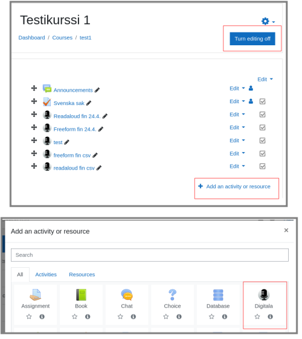

 

On the adding page the teacher has the option to give the activity a **name** which will be shown on the course page. Other options include:

* **Language** - if the assignment if for Finnish or Swedish speech performance
* **Type** - whether the assignment is to read a given text aloud or to talk more freely about the topic of the assignment
* **Time limit** - A time limit for student speech performance which maxes up and defaults to 5 minutes.
* **Attempt limit** - Optional limit for how many times students can submit their answer for evaluation. Defaults to unlimited.
* **Assignment** - The assignment that the user should complete. This prompt will be sent to the evaluation API in the Freeform type of assignment, so if the API is trained with these kinds of tasks, it should also give a reasonable evaluation for "Task completion".
* **Material** - If using Readaloud type of assignment, the text to be read should be provided here, preferrably in plain text. In Readaloud type this text will be sent to the evaluation API and the speech performance will be compared to this text. In Freeform type this field can be used to provide additional material such as helper questions or different media snippets.
* **Description** - This description won't be shown anywhere at the moment so there's no need for the use of it.

  
Figure: Digitala settings

  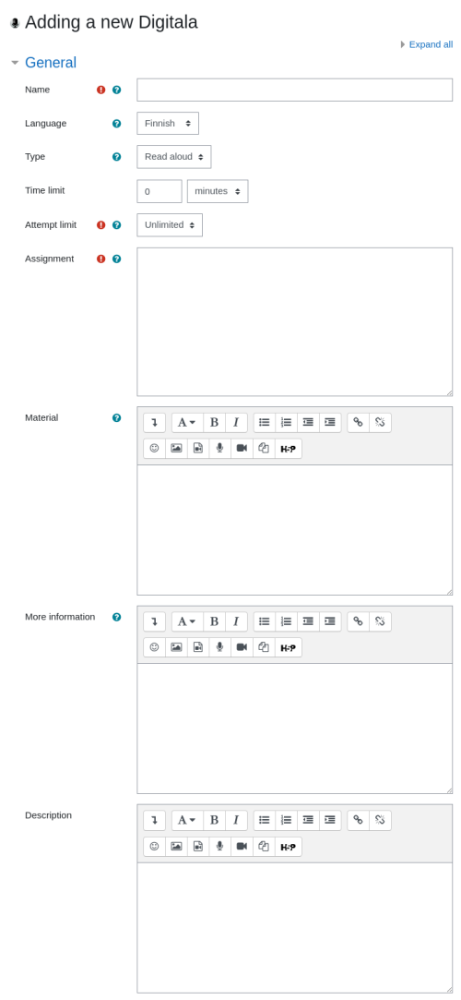

 

### Editing and deleting a Digitala

The Digitala setup can be edited from the activity wheel inside the Digitala instance.

  
Figure: Editing Digitala inside the activity

  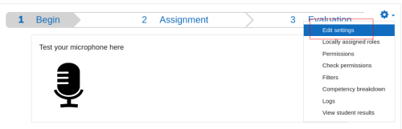

 

Also the editing mode on the course front page allows both editing and deleting the Digitala instance.

  
Figure: Editing Digitala from course front page

  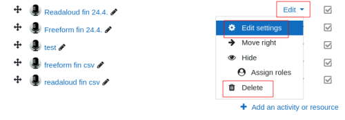

 

### See student results

A teacher can access the overview of the student results by choosing "View student results" on the activity wheel in the Digitala.

  
Figure: Navigating to student results overview

  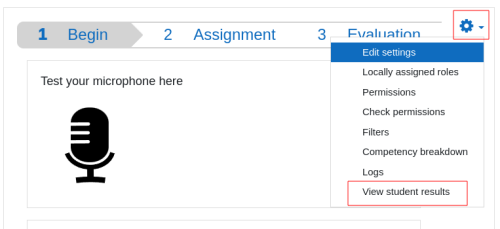

 

Here the teacher can see the main grade of the students' speech performance, the length of the recording, the number of tries the student has made and the status of the evaluation. Here the teacher can also delete the attempts from one or all students, which will result in resetting the student's attempts to zero. From the link "See report" the teacher can see a detailed version of the student's evaluation report.

  
Figure: Overview of student results

  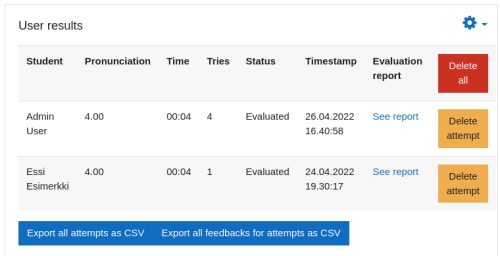

 

### Give suggestions to correct automated assessment

On the overview of the student results the teacher can see a detailed version of the student's performance by clicking the link "See report".

  
Figure: Teacher view of student's evaluation report

  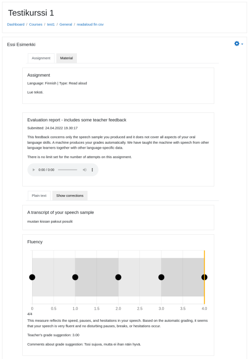

 

On the bottom right of this view the teacher can also give feedback to the address set by the admin and on the bottom left also suggest changes to the automatic assessment.

  
Figure: Buttons for changing grades or giving feedback

  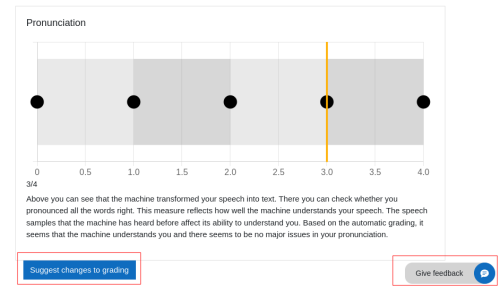

 

  
Figure: Suggesting changes to automatic grades

  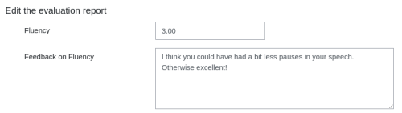

 

The most recent teacher suggestions will be shown on the student report page both for the teacher and the student.

  
Figure: Teacher comments on detailed student report

  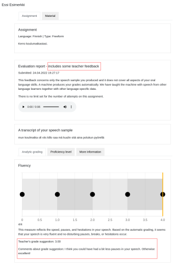

 

### Download database reports

On the overview of the student results the teacher can download the database information in a CSV-form for both the attempts and the teacher suggestions for the grade changes.

  
Figure: Downloading database reports

  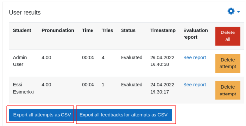

 

The database information includes more detailed information received from the evaluation API such as fluency features or pronunciation features which constitute the score for fluency and pronunciation.

## Student usage

A student can
* [test their microphone on the first view](#testing-microphone)
* [see the assignment](#the-assignment-and-materials) prompt and materials on the assignment view
* [record, listen and submit](#recording-and-submitting-speech) their speech performance on the assignment view
* [receive an automated evaluation](#evaluation-report-of-speech) of their performance on the evaluation view
* [see teacher's feedback](#teachers-grading-suggestions) about the automated evaluation
* [give feedback on the Digitala](#give-feedback-on-digitala)

### Testing microphone

On the first view the student can test if their microphone works. The browser may ask to give permissions to use the microphone. The student can record a speech snippet and try to playback the sound. If everything sounds right and the microphone icon shows a green circle behind it, the settings are fine for the assignment. If there's something to correct with the microphone permissions, the play button will prompt to check settings.

Testing of the mic is optional. The student can move to the next phase from navigation bar on the top or button on the bottom.

### The assignment and materials

On the assignment page the student can see the assignment prompt on the left and additional materials on the right. If the assignment is a Readaloud type, then the text to be read is on the material box. Bottom left there's a box for the recording. This box also shows if there's a time limit for the recording or submission limit to the assignment.

### Recording and submitting speech

The student can record their answer to the assignment multiple times by clicking the start and stop buttons on the recording box. After stopping a submission button is shown. If the student chooses to submit, the Digitala will redirect to the report page and show a loading symbol and text during the automated assessment. The evaluation can take from seconds to minutes depending on the recording length and other variables. In this point the student is free to move in the Moodle and come later to check if the evaluation is ready. When the evaluation is in a waiting status, the recording ability on the assignment page is also disabled.

### Evaluation report of speech

After the evaluation a report of the speech performance can be shown on the third phase. This includes the recording and a transcript of the speech. In the Readaloud type includes also a transcript showing missing parts in orange underline and incorrect parts in skyblue. Charts show where the studen score is in a linear line and the black dots on charts hold the descriptions of different grades.

### Teacher's grading suggestions

If a teacher has suggested changes to the automated evaluation, the title of the evaluation report will show as "Evaluation report - includes some teacher feedback". The latest teacher grading suggestions and comments can be found on the bottom part of every grading box.

### Give feedback on Digitala

On the bottom of the third page is a hovering link "Give feedback" which will pop up to a feedback box. The origin of this feedback site can be set by the [administrator on the plugin settings](#admin-usage). The pop up closes by clicking on it again.